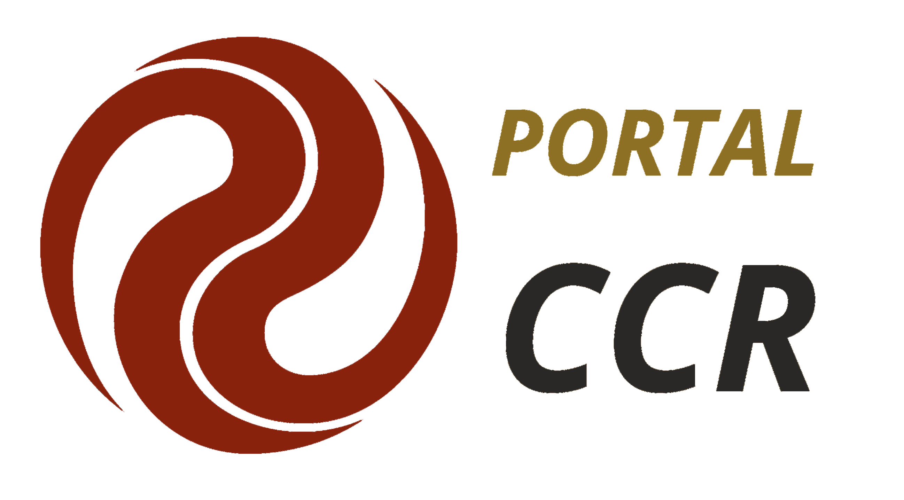

<h1 align="center">
    
</h1>

<p align="center">
  <a href="#loudspeaker-tecnologias">Tecnologias</a>&nbsp;&nbsp;&nbsp;|&nbsp;&nbsp;&nbsp;
  <a href="#computer-projeto">Projeto</a>&nbsp;&nbsp;&nbsp;|&nbsp;&nbsp;&nbsp;
  <a href="#gear-execução-do-projeto">Execução do Projeto</a>&nbsp;&nbsp;&nbsp;|&nbsp;&nbsp;&nbsp;
  <a href="#memo-licença">Licença</a>
</p>

## :loudspeaker: &nbsp;  Tecnologias

Esse projeto foi desenvolvido com as seguintes tecnologias:

- [Ionic](https://ionicframework.com/)
- [Angular](https://angular.io/)
- [Firebase](https://firebase.google.com/?hl=pt_br)

## 💻 &nbsp; Projeto

O **Portal CCR** surge como a opção para unicidade das informações que o Grupo CCR possui e trás a implementação de um módulo de Gamificação com o objetivo de incentivar e estimular cuidados com a saúde e bem-estar para o nosso Persona (amigo Caminhoneiro) e outro de Prontuário Médico em que terá um registro dos atendimentos, dentre outros apresentados em nosso Pitch Deck como Visão de Futuro.

A **Gamificação** se dará pela leitura de QR Code que irão creditar ou debitar pontos. Para Exemplificar: realizou o cadastro, credita 50 pontos; cortou o cabelo, 100 pontos; realizou consulta médica preventiva, 100 pontos; realizou exercício tabata (pré-requisito ter feito a consulta médica), 20 pontos; e outros. Estes pontos serão trocados em estabelecimentos parceiros (motivados pela grande base de dados) por itens como: banho, debita 40 pontos; limpar a gabine, 60 pontos; cafézinho, 20 pontos; pernoite 400 pontos; e outros.

O **Prontuário Médico** visa manter o histórico do atendimento e dos dados referentes a saúde do caminhoneiro. Exemplificando: ao ser atendido na Dutra, ele passará por uma série de procedimentos e responderá a inúmeras perguntas, necessárias para o correto atendimento. No próximo atendimento, independente em qual Posto CCR ele venha a necessitar de um novo atendimento, ao digitar o CPF, automaticamente será carregado os seus dados e histórico de atendimentos.

## :gear: &nbsp;  Execução do Projeto
**Clonando o repositório:**

```bash 
git clone https://github.com/danecosta/portal-ccr.git
```

**Instalando as dependências**

```bash 	 
npm install
```

**Executando o aplicativo no navegador**

``` bash
ionic s
```

**Executando o aplicativo no android**

``` bash
ionic cordova run android
```

## :memo: &nbsp; Licença

Esse projeto está sob a licença MIT. Veja o arquivo [LICENSE](LICENSE.md) para mais detalhes.

---

Created by Daniela Costa
